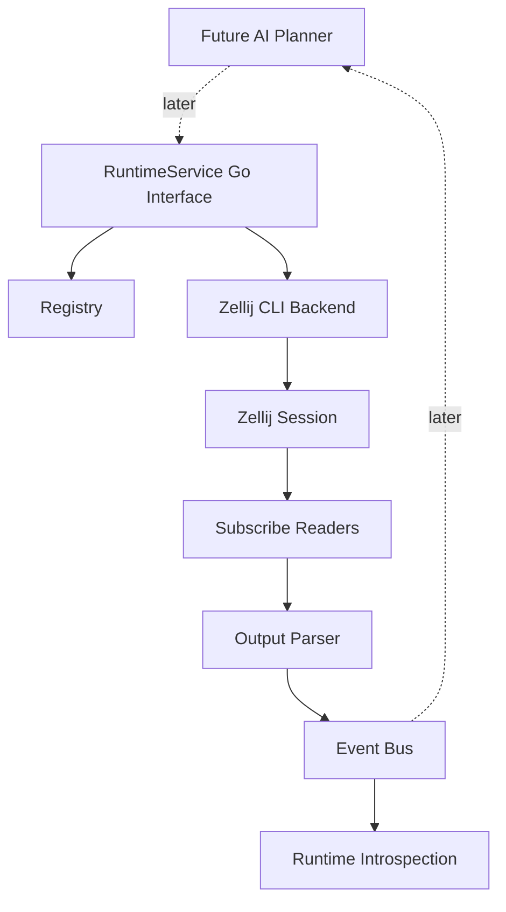

# feat: Build Zellij Agent Runtime MVP

## Summary

Build a small Go-based `agentd` runtime that treats Zellij as an observable execution fabric. The MVP keeps all direct Zellij control inside the daemon, exposes a stable internal `RuntimeService` interface that a future AI planner can call later, tracks pane lifecycle in a registry, converts pane output into semantic events, and provides enough introspection for debugging the runtime.

---

## Problem Frame

The architecture notes establish the core invariant: the AI planner decides what should happen, but the registry daemon is the only process allowed to create, mutate, subscribe to, reconcile, and clean up Zellij panes. Without that boundary, pane IDs, subscriptions, concurrent input, recovery, and observability become scattered across planner logic.

This plan turns the concept documents into an implementation sequence for the first usable runtime, not a complete multi-agent product.

---

## Requirements

- R1. Provide a daemon-owned runtime boundary where only `agentd` invokes `zellij action` or `zellij subscribe`.
- R2. Maintain stable logical agent/task/pane records even though Zellij pane IDs are ephemeral.
- R3. Create, send input to, inspect, subscribe to, and close Zellij panes through a runtime API.
- R4. Convert raw pane output and pane lifecycle changes into typed runtime events.
- R5. Expose enough runtime introspection for a planner or developer to inspect sessions, panes, and recent events.
- R6. Keep the MVP usable without implementing full LLM planning, autonomous code modification, or distributed orchestration.

---

## Scope Boundaries

- The MVP does not implement the AI planner reasoning loop. It provides the runtime substrate and internal service interface that a planner can call later.
- The MVP does not build a Zellij WASM plugin. It uses the documented CLI control surface first.
- The MVP does not guarantee durable recovery of every running pane after daemon restart. It should reconcile visible Zellij state, but full persistence can follow.
- The MVP does not stream every raw terminal byte to an LLM. It stores and filters output into runtime events.
- The MVP does not implement a human-facing CLI or rich TUI dashboard. Minimal daemon introspection endpoints or logs are enough.

### Deferred to Follow-Up Work

- Planner integration: connect an LLM planner to the internal `RuntimeService` after daemon behavior is reliable.
- External transport: add Unix socket, stdio JSON-RPC, HTTP, or gRPC only when a real external client needs it.
- Durable task history: persist event logs and task state beyond an in-memory or local-file MVP.
- Zellij plugin backend: evaluate the plugin API if CLI subscribe/list-panes limits become blocking.
- Multi-host orchestration: keep the first implementation local to one machine and one Zellij session.

---

## Context & Research

### Relevant Documents and Patterns

- `docs/full-ai-agent-zellij-conversation.md` defines the core separation: planner -> runtime API -> registry daemon -> Zellij.
- `docs/ai-agent-zellij-runtime-architecture.md` describes the desired create/subscribe/event/retest/cleanup flow.
- `docs/zellij-docs.md` documents the practical control surface: `list-panes --json`, `new-pane`, `paste`, `send-keys`, `close-pane`, `dump-screen`, and `subscribe --format json`.

### External References

- Zellij CLI actions are enough for the MVP because they return created pane/tab IDs and expose JSON state snapshots.
- `zellij subscribe --format json` should be treated as an NDJSON stream that feeds the daemon's subscription manager.
- `dump-screen --full` remains useful as a fallback or final-output snapshot after pane exit.

---

## Key Technical Decisions

- Build the runtime in Go: the existing architecture notes use Go-shaped registry/event examples, and Go is a good fit for long-running subprocesses, channels, and daemon code.
- Use the Zellij CLI as the first backend: it keeps the MVP simple and matches the available documentation without introducing a plugin build pipeline.
- Make `agentd` the single writer to Zellij: all pane creation, input, subscription, and cleanup must flow through daemon-owned services to avoid interleaved writes and stale registry state.
- Model logical runtime IDs separately from Zellij IDs: `agent_id`, `task_id`, and daemon-owned pane records should remain stable even when Zellij returns IDs such as `terminal_5`.
- Start with an in-process event bus: it is enough for the first daemon and can later be bridged to persistence, transport streaming, or planner subscribers.
- Treat transport as deferred: define the Go service contract first, then expose it through Unix socket, stdio, HTTP, or gRPC only when needed.
- Keep semantic parsing rule-based in the MVP: detect coarse events like process exit, server ready, test failed, test passed, and raw output; leave LLM-based interpretation to planner integration.

---

## Open Questions

### Resolved During Planning

- Should the planner call Zellij directly? No. The daemon API owns all Zellij interaction.
- Should every pane output go to the AI planner? No. The daemon subscribes broadly, but filtering decides what becomes semantic events.
- Should the first version use the Zellij plugin API? No. Use CLI control first and revisit only if CLI events are insufficient.

### Deferred to Implementation

- Exact external transport: defer until there is a real planner or external client. The MVP should use an internal Go `RuntimeService` boundary first.
- Exact persistence layer: start in memory or with a simple local state file; move to SQLite only if restart recovery needs it.
- Exact event matcher vocabulary: tune event types while testing real command outputs from common build/test/dev workflows.

---

## Output Structure

```text
cmd/
  agentd/
internal/
  eventbus/
  registry/
  runtime/
  supervisor/
  zellij/
docs/
  plans/
```

The tree is a target shape, not a hard constraint. Implementation can adjust package names if Go conventions or tests reveal a cleaner boundary.

---

## High-Level Technical Design

> *This illustrates the intended approach and is directional guidance for review, not implementation specification. The implementing agent should treat it as context, not code to reproduce.*



The important dependency direction is one-way: callers request outcomes through `RuntimeService`; only `agentd` executes Zellij commands; subscriptions feed events back into daemon state and planner-visible runtime events. The AI planner is intentionally a later consumer, not part of the MVP.

---

## Implementation Units

- U1. **Bootstrap Go Module and Daemon Layout**

**Goal:** Establish a minimal Go project layout with an `agentd` entry point.

**Requirements:** R1, R6

**Dependencies:** None

**Files:**
- Create: `go.mod`
- Create: `cmd/agentd/main.go`
- Create: `internal/runtime/doc.go`
- Test: `cmd/agentd/main_test.go`

**Approach:**
- Keep startup behavior minimal: `agentd` starts daemon services and wires the internal runtime boundary.
- Avoid committing to a complex framework. Use standard library packages unless a dependency clearly removes real complexity.
- Add package boundaries early so later runtime, registry, event bus, and Zellij backend code has an obvious home.

**Patterns to follow:**
- Preserve the role separation described in `docs/ai-agent-zellij-runtime-architecture.md`.

**Test scenarios:**
- Happy path: invoking `agentd` with a help/version-style mode exits successfully and identifies the command.
- Error path: invalid command arguments produce a clear error without starting daemon services.

**Verification:**
- The repo has a buildable Go module with a daemon entry point.

---

- U2. **Define Runtime Domain Model and Registry**

**Goal:** Implement the stable logical state model for sessions, panes, agents, tasks, and pane lifecycle status.

**Requirements:** R2, R5

**Dependencies:** U1

**Files:**
- Create: `internal/registry/registry.go`
- Create: `internal/registry/types.go`
- Test: `internal/registry/registry_test.go`

**Approach:**
- Treat Zellij pane IDs as backend identifiers, not primary domain identity.
- Store daemon-owned records keyed by stable IDs such as task, agent, and logical pane IDs.
- Include enough state for lifecycle reconciliation: role, command, cwd, Zellij pane ID, status, timestamps, and last observed output summary.
- Keep the initial registry concurrency model explicit and testable. A single manager goroutine or mutex-protected map is acceptable; choose the simpler implementation during execution.

**Patterns to follow:**
- The conversation document's principle that panes are disposable while agents are persistent.

**Test scenarios:**
- Happy path: registering a pane creates a stable logical record and associates the returned Zellij pane ID.
- Happy path: updating pane status preserves the logical agent/task association.
- Edge case: removing an unknown pane returns a predictable not-found result.
- Edge case: reusing a Zellij pane ID for a new logical pane does not mutate the old logical record.

**Verification:**
- Registry behavior is deterministic under create, update, lookup, list, and remove operations.

---

- U3. **Implement Zellij CLI Backend**

**Goal:** Encapsulate all `zellij` subprocess calls behind a backend interface owned by the daemon.

**Requirements:** R1, R3

**Dependencies:** U1, U2

**Files:**
- Create: `internal/zellij/backend.go`
- Create: `internal/zellij/commands.go`
- Create: `internal/zellij/types.go`
- Test: `internal/zellij/backend_test.go`

**Approach:**
- Wrap Zellij actions for create pane, close pane, send input, list panes, dump screen, and subscribe.
- Parse JSON outputs with structured types instead of ad hoc string parsing.
- Serialize dependent operations that target the same pane, especially paste/send-enter sequences, so concurrent input cannot interleave.
- Design the backend around an interface so tests can use fake command runners and later implementations can swap in plugin-based control.

**Patterns to follow:**
- `docs/zellij-docs.md` guidance that dependent Zellij actions should be chained or otherwise serialized.
- `docs/zellij-docs.md` distinction between `subscribe` for streaming and `dump-screen` for snapshots.

**Test scenarios:**
- Happy path: creating a pane parses the returned Zellij pane ID and returns it to the runtime layer.
- Happy path: listing panes parses JSON pane metadata into typed records.
- Error path: missing `zellij` binary or failed command returns an actionable backend error.
- Error path: malformed JSON from a query command is surfaced without corrupting registry state.
- Integration: fake command runner records that send-input operations preserve ordering for one pane.

**Verification:**
- No package outside the daemon runtime/backend calls `zellij` directly.

---

- U4. **Create Internal RuntimeService**

**Goal:** Expose daemon operations for pane creation, input, inspection, and cleanup through an internal Go service interface.

**Requirements:** R1, R3, R6

**Dependencies:** U2, U3

**Files:**
- Create: `internal/runtime/service.go`
- Create: `internal/runtime/types.go`
- Modify: `cmd/agentd/main.go`
- Test: `internal/runtime/service_test.go`

**Approach:**
- Define request/response types for create pane, send input, list panes, inspect pane, close pane, and snapshot output.
- Keep transport out of the MVP. The service should be testable in process before any local HTTP, Unix socket, stdio, or gRPC adapter exists.
- Have runtime methods update registry state around backend calls, including failure paths where pane creation or cleanup fails.
- Keep service shapes planner-ready rather than human-command friendly: structured requests, structured responses, and event subscription support.

**Patterns to follow:**
- The architecture note's `planner -> runtime API -> registry daemon -> zellij` direction.

**Test scenarios:**
- Happy path: create pane calls the backend, registers the pane, and returns logical plus Zellij IDs.
- Happy path: send input resolves a logical pane ID to a Zellij pane ID and calls the backend once.
- Edge case: sending input to an unknown logical pane returns not found without backend calls.
- Error path: backend create failure does not leave a registered healthy pane.
- Integration: an in-process test harness can exercise runtime operations without bypassing the service.

**Verification:**
- In-process callers can create, list, send input to, inspect, and close a pane through `RuntimeService` without direct Zellij calls.

---

- U5. **Add Subscription Manager and Event Bus**

**Goal:** Stream pane output from Zellij, normalize it into runtime events, and publish those events to consumers.

**Requirements:** R3, R4, R5

**Dependencies:** U2, U3, U4

**Files:**
- Create: `internal/eventbus/bus.go`
- Create: `internal/eventbus/types.go`
- Create: `internal/runtime/subscriptions.go`
- Create: `internal/runtime/parser.go`
- Test: `internal/eventbus/bus_test.go`
- Test: `internal/runtime/subscriptions_test.go`
- Test: `internal/runtime/parser_test.go`

**Approach:**
- Start one subscription reader per managed pane when the runtime creates or adopts a pane.
- Convert Zellij NDJSON stream events into a small set of daemon events: raw output, pane closed, process exited, server ready, test failed, test passed, and health changed.
- Keep raw output available for recent inspection, but publish semantic events as the main planner-facing signal.
- Ensure subscription cancellation happens when a pane is closed or removed.

**Patterns to follow:**
- `docs/full-ai-agent-zellij-conversation.md` describes daemon-wide subscribe ownership with daemon-side filtering.
- `docs/zellij-docs.md` documents `subscribe --format json` as a long-running stream and `pane_closed` as a lifecycle signal.

**Test scenarios:**
- Happy path: a pane output update publishes raw output and matching semantic events.
- Happy path: pane closed event updates registry status and cancels the subscription.
- Edge case: repeated identical viewport updates do not flood duplicate semantic events beyond the chosen dedupe policy.
- Error path: malformed subscription lines are recorded as stream errors without crashing the daemon.
- Error path: subscription process exit changes pane health and publishes a health event.

**Verification:**
- Supervisor consumers can subscribe to runtime events without coupling to Zellij's raw NDJSON shape.

---

- U6. **Implement Reconciliation and Cleanup**

**Goal:** Keep daemon registry state aligned with the current Zellij session and provide safe cleanup for managed panes.

**Requirements:** R1, R2, R3, R5

**Dependencies:** U2, U3, U5

**Files:**
- Create: `internal/runtime/reconcile.go`
- Create: `internal/runtime/cleanup.go`
- Test: `internal/runtime/reconcile_test.go`
- Test: `internal/runtime/cleanup_test.go`

**Approach:**
- Periodically or manually compare registry records with `list-panes --json`.
- Mark missing panes as closed or lost rather than deleting history immediately.
- Close only daemon-managed panes by default. Avoid destructive cleanup of unrelated Zellij panes in the same session.
- Provide an explicit cleanup operation for a task, role, or all daemon-managed panes.

**Patterns to follow:**
- The architecture documents' cleanup and recovery responsibilities belong to the daemon, not the planner.

**Test scenarios:**
- Happy path: reconciliation updates exited panes and preserves active panes.
- Edge case: Zellij contains unmanaged panes; reconciliation ignores or reports them without adopting by default.
- Error path: `list-panes` failure leaves existing registry state intact and emits a health event.
- Error path: cleanup failure for one pane does not prevent attempts on other managed panes, and the result reports partial failure.

**Verification:**
- Daemon state remains understandable when panes exit, disappear, or fail to close.

---

- U7. **Build Minimal Runtime Introspection**

**Goal:** Provide developer visibility into current registry state, recent events, and pane output snapshots without adding a separate human CLI or external transport.

**Requirements:** R5, R6

**Dependencies:** U4, U5, U6

**Files:**
- Create: `internal/supervisor/view.go`
- Test: `internal/supervisor/view_test.go`

**Approach:**
- Add structured introspection methods for status, panes, recent events, and output snapshots through the internal service boundary.
- Keep the shape optimized for future planner consumption first, with readable logs for developer debugging.
- Include logical IDs, roles, Zellij IDs, status, command, and recent event summaries.

**Patterns to follow:**
- The conversation document's supervisor pane purpose: dashboard, observability, and intervention UI.

**Test scenarios:**
- Happy path: status response lists managed panes grouped by task or role.
- Happy path: events response returns recent semantic events in order.
- Edge case: empty registry produces a useful "no managed panes" state.
- Error path: dump for an unknown pane reports not found without backend calls.

**Verification:**
- A developer can understand what the daemon owns and what happened recently without inspecting raw Zellij state manually.

---

- U8. **Document MVP Operation and Invariants**

**Goal:** Capture how to run the MVP and the architectural invariants future work must preserve.

**Requirements:** R1, R5, R6

**Dependencies:** U1-U7

**Files:**
- Create: `README.md`
- Modify: `docs/ai-agent-zellij-runtime-architecture.md`
- Test: none

**Approach:**
- Document the local setup, daemon startup, internal `RuntimeService` shape, and how Zellij sessions are selected.
- Explicitly state the invariant that planners and any clients must not invoke Zellij directly.
- Explain the current limitations: local-only, rule-based events, minimal persistence, and no LLM planner yet.

**Patterns to follow:**
- Keep the explanation aligned with the existing Korean architecture notes while giving implementation-level entry points.

**Test scenarios:**
- Test expectation: none -- documentation-only unit; verify by following the documented run path during implementation.

**Verification:**
- A new contributor can start the daemon, understand the internal runtime service, create a pane through the daemon boundary, observe events, and clean up managed panes from the README or tests.

---

## System-Wide Impact

- **Interaction graph:** The AI planner interacts with `agentd`, not Zellij. `agentd` coordinates registry, backend, subscriptions, events, and introspection.
- **Error propagation:** Backend errors should surface through runtime responses and health events. They should not silently mutate registry state into a successful-looking record.
- **State lifecycle risks:** Pane IDs can disappear or be reused; logical IDs and reconciliation must prevent accidental mutation of stale records.
- **API surface parity:** Any debug or test harness must use the same runtime service the planner uses.
- **Integration coverage:** Unit tests should cover fake backend behavior; later manual or integration checks should prove real Zellij create/subscribe/dump/close behavior.
- **Unchanged invariants:** Zellij remains the execution runtime, not the system of record. The registry daemon remains the system of record for managed runtime state.

---

## Risks & Dependencies

| Risk | Mitigation |
|------|------------|
| Zellij CLI output differs across versions | Keep parsing isolated in `internal/zellij`, test malformed and missing fields, and document the tested Zellij version during implementation. |
| `subscribe` streams rendered viewport updates rather than raw process stdout | Treat subscription data as observation events, use dedupe/filtering, and keep `dump-screen --full` for snapshots. |
| Concurrent writes to a pane interleave | Serialize daemon-owned input operations per pane. |
| Daemon restart loses in-memory state | Make reconciliation visible in the MVP and defer durable persistence until the runtime shape stabilizes. |
| The runtime API becomes planner-specific too early | Keep request/response types focused on terminal orchestration primitives, not LLM reasoning concerns. |

---

## Documentation / Operational Notes

- Document that `agentd` must be running before any planner-like client starts.
- Document whether the daemon creates a headless Zellij session or attaches to a named existing session.
- Record the exact Zellij commands used by the backend in developer documentation so behavior can be debugged without reading every package.
- Add a short "invariants" section warning future contributors not to bypass the daemon for direct Zellij control.

---

## Sources & References

- **Origin document:** [docs/full-ai-agent-zellij-conversation.md](../full-ai-agent-zellij-conversation.md)
- **Architecture flow:** [docs/ai-agent-zellij-runtime-architecture.md](../ai-agent-zellij-runtime-architecture.md)
- **Zellij control reference:** [docs/zellij-docs.md](../zellij-docs.md)
